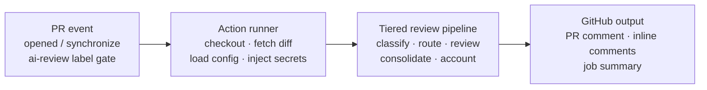

# Reference Architecture: Automated Tiered PR Review with GitHub Actions

A first-pass review pipeline that assigns each pull request hunk to the least expensive model tier capable of reviewing it well, then posts one consolidated result with a complete cost trail.

## Overview

A GitHub Actions workflow starts when a pull request is opened or updated and carries the `ai-review` label. The runner collects the diff, loads repository policy and secrets, and invokes a reusable `tiered_review/` pipeline. Low-cost models handle triage and style, medium-cost models inspect logic, and frontier models are reserved for security and architecture risk. The system never approves or merges; it produces a review for a human to evaluate.

## System flow



## Pipeline core: `tiered_review/`

| Stage | Job |
|---|---|
| **Triage** | Split the diff into reviewable hunks; tag language, size, file type, and obvious change class. |
| **Router** | Score risk 1–5, apply skip rules, select a tier, and reserve spend against the PR budget. |
| **Reviewers** | Run quick, standard, or deep analysis only where the assigned risk justifies it. |
| **Synthesizer** | Deduplicate findings, normalize severity, and build one concise review. |
| **Ledger** | Record provider, model, tokens, latency, estimated cost, and routing reason for every call. |

The ledger is cross-cutting: every model call passes through it, regardless of tier or mode.

## Routing policy

| Risk | Tier | Model class | Review focus |
|---|---|---|---|
| 1–2 | Quick pass | Low-cost | Formatting, naming, obvious defects, documentation drift, small isolated changes. Optimize for speed and high recall on simple issues. |
| 3 | Standard review | Medium-cost | Business logic, control flow, API behavior, tests, error handling, changes spanning several files. Reasoning quality at bounded cost. |
| 4–5 | Deep review | Frontier | Authentication, authorization, cryptography, migrations, concurrency, destructive operations, cross-service contracts, architectural changes. |

**Enforcement points:**

| Decision | Point | Behavior |
|---|---|---|
| Skip | Before model selection | Docs-only, generated files, vendor code, or tiny diffs are ignored or handled by deterministic checks. |
| Route | Per hunk, not only per PR | A single PR may use several tiers; a README edit does not inherit the risk of an authentication change. |
| Budget | Before each model call | The router estimates cost, checks the remaining cap, and downgrades, batches, or stops according to policy. |
| Escalate | After reviewer output | A lower tier may request a deeper review when it detects a sensitive pattern, uncertainty, or broad impact. |

Budget rule: the router owns admission control. No reviewer calls a model directly; all calls go through the shared adapter and cost ledger.

## Configuration

`tiered-review.yml` is repository policy — behavior changes without code changes:

```yaml
models:
  quick:    provider/low-cost-model
  standard: provider/medium-model
  deep:     provider/frontier-model
routing:
  quick_max_risk: 2
  standard_max_risk: 3
  deep_min_risk: 4
budget:
  max_usd_per_pr: 0.75
  on_exhausted: summarize_and_stop
skip:
  docs_only: true
  max_tiny_diff_lines: 8
  paths:
    - "vendor/**"
    - "**/*.lock"
output:
  inline_comments: true
  max_inline_comments: 10
```

Model identifiers are examples; replace with approved provider models.

## Secrets and permissions

- Store provider keys in GitHub Secrets; never commit them.
- Grant the workflow read access to contents and pull requests, plus write access to PR comments only when posting is enabled.
- Forks supply their own provider keys. Secrets are not exposed to untrusted fork workflows.

## Two modes, one pipeline core

| | Demo mode | Live mode |
|---|---|---|
| Input | Sample diffs from `demo_diffs/` | Pull request diff from GitHub |
| Models | Mock adapter | Configured provider adapters |
| Output | Terminal or file report | PR comment, inline findings, job summary |
| External cost | $0 | Bounded by policy |

- **Zero-key setup:** the mock adapter is the default for local and demo runs — deterministic tiered findings, ledger entries, and formatted output without calling an external model.
- **Adapter boundary:** model providers, GitHub posting, and cost calculation sit behind interfaces. The routing and synthesis core does not depend on one vendor.

## Guardrails

- **Label gate:** no review runs unless the PR carries `ai-review`.
- **Per-PR budget:** spend is reserved before each model call.
- **Skip rules:** low-value paths and tiny diffs avoid unnecessary model calls.
- **Human decision:** the workflow never approves or merges a pull request. Existing branch protection (required human reviews, tests, security checks) still decides merges.
- **Auditable calls:** every call records model, tokens, latency, cost, and reason.
- **Bounded output:** inline comment limits prevent noisy review floods.

## End-to-end sequence

1. **Gate the event** — a PR is opened or updated; the workflow exits unless the `ai-review` label is present.
2. **Build the review context** — the runner checks out base and head, fetches PR metadata and diff hunks, loads repository policy.
3. **Prepare safe inputs** — skip excluded files, cap diff size, redact configured patterns, split into reviewable hunks.
4. **Score and route** — triage metadata and deterministic rules produce a 1–5 risk score; the router selects quick, standard, or deep review.
5. **Reserve the budget** — before every call, the router estimates cost and confirms the remaining PR cap covers it.
6. **Run tiered analysis** — assigned reviewers return structured findings; sensitive or uncertain findings may request escalation.
7. **Synthesize the result** — deduplicate, rank, and format findings into one summary with bounded inline comments.
8. **Publish and report** — the GitHub adapter posts the review; the job summary shows hunk counts, tier decisions, tokens, latency, and total estimated cost.

## Repository layout

```
.
├── .github/workflows/
│   └── tiered-review.yml
├── tiered-review.yml
├── tiered_review/
│   ├── cli.py
│   ├── intake.py
│   ├── triage.py
│   ├── router.py
│   ├── reviewers/{quick,standard,deep}.py
│   ├── synthesizer.py
│   ├── ledger.py
│   └── adapters/{mock,models,github}.py
├── demo_diffs/
└── tests/
```

Implementation principle: keep GitHub-specific event handling and provider-specific API calls at the edges. The routing, review contracts, synthesis, and ledger stay portable and independently testable.
